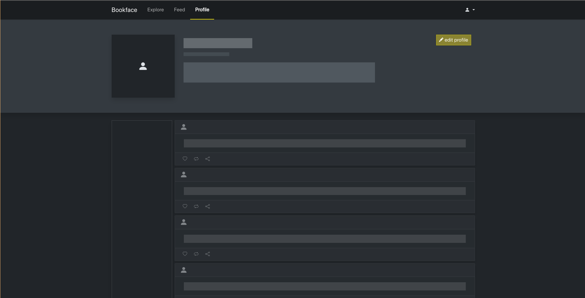

# Bookface

> Currently in the process of to react+astro components

Welcome to Bookface, your go-to social media platform designed exclusively for web developers. Connect, share, and explore the world of coding with like-minded individuals. Whether you're a seasoned developer or just starting your coding journey, Bookface is the place to be.

> Created by: [Jonathan Groberg](https://github.com/joncgroberg)
> , [Armanie Feliciano](https://github.com/MrRobut98), and [Xabier Jones](https://github.com/l3tsgititzay)

### Links

> [Bookface API docs](http://microbloglite.us-east-2.elasticbeanstalk.com/docs/)

> [Bookface Wiki](https://github.com/JonCGroberg/microbloglite-capstone-starter/wiki/)

## Landing page


- Ability to log in or create account
- Intutitive and leave user interface design
- Intuitive user feedback
  - Login failure message
  - Logging in loading animation

### User feedback/ Loading animation


### Validation


## Registration Page


- Create a user by inputing required values for you Name, Username, and Password
- If no such account exists your registrations will be successful and you will be redirected to the posts page
- By submitting the register button you will be agreeing to our terms and conditions and privacy policy which can be viewed by clicking the hyperlinks

## Post Content Page


## Profile Page


- The posts page, allows developers to share their thoughts code snippets, and project updates
- Engage with the community by liking, commenting, and sharing posts that resonate with you.

### Loading Placeholders



## Notable features and code snippets

### Returning promises for more readable and logical code

 `landing.js/loginhandler` Demonstration


```javascript
// loads until a successfull login or failed login
setLoadingState();
login(loginData).then(successRedirect).catch(setFailureState);
```
`Auth.js/login` Implementation

Returns a promise allowing failure and success logic to be handled uniquely on a page by page basis. Additionally allows for more clean and readable code


```javascript
// Saves login data if success and throws an error otherwise
return await fetch(API_URL + "/auth/login", options)
  .then((res) => res.json())
  .then((userData) => {
    if (userData.statusCode === 200) storeLocalUserData(userData, loginData);
    else throw new Error("Login failed with code: " + userData.statusCode);
  });
```

## Structure

The project is organized into several directories, each containing the HTML, CSS, and JavaScript files for a specific feature of the application:

- `landing/`: Contains the files for the landing page of the application.
- `registration/`: Contains the files for the user registration feature.
- `profile/`: Contains the files for the user profile feature.
- `posts/`: Contains the files for the posts feature.
