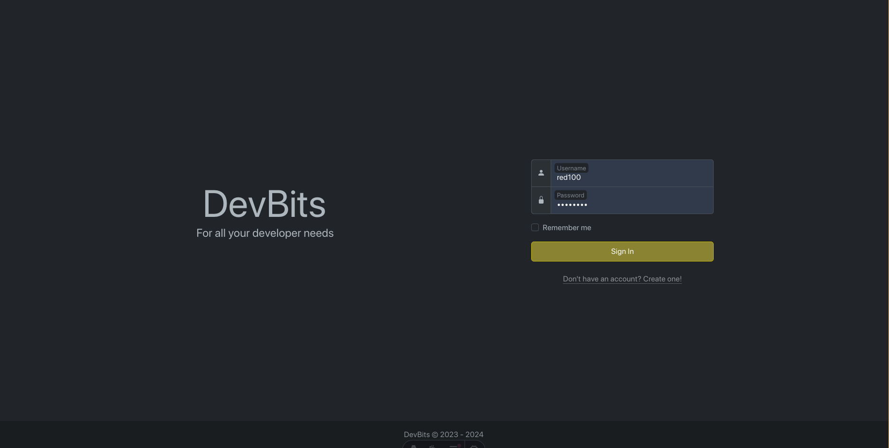
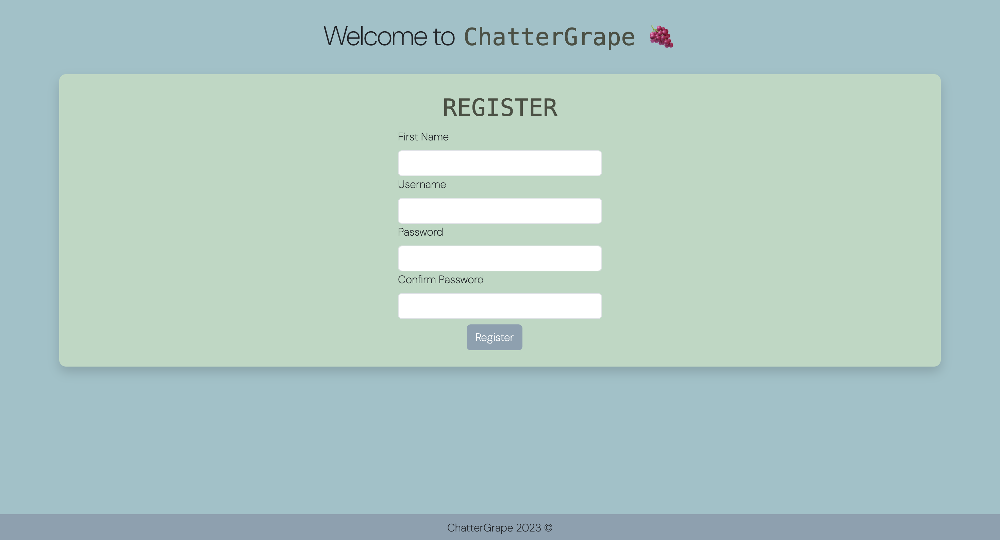
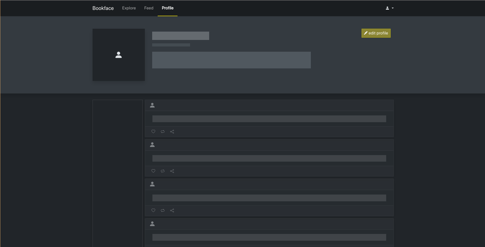

# DevBits

> Currently in the process of porting all aspects of the page to react+astro components [Track Progress Here](https://github.com/users/JonCGroberg/projects/9)

Welcome to DevBits, your go-to social media platform designed exclusively for web developers. Connect, share, and explore the world of coding with like-minded individuals. Whether you're a seasoned developer or just starting your coding journey, DevBits is the place to be.

Created by: [Jonathan Groberg](https://github.com/joncgroberg)
, [Armanie Feliciano](https://github.com/MrRobut98), and [Xabier Jones](https://github.com/l3tsgititzay)

> **Try the [live site](https://devbits-frontend.netlify.app/)!**
>
> Create your own user or **login** with as `test` with **password**: `test`

### Links

[DevBits API docs](http://microbloglite.us-east-2.elasticbeanstalk.com/docs/)

[DevBits Wiki](https://github.com/JonCGroberg/microbloglite-capstone-starter/wiki/)

## Landing page



- Ability to log in or create account
- Intutitive and leave user interface design
- Intuitive user feedback
  - Login failure message
  - Logging in loading animation

### User feedback/ Loading animation


### Validation


## Registration Page



- Create a user by inputing required values for you Name, Username, and Password
- If no such account exists your registrations will be successful and you will be redirected to the posts page
- By submitting the register button you will be agreeing to our terms and conditions and privacy policy which can be viewed by clicking the hyperlinks

## Post Content Page


## Profile Page


- The posts page, allows developers to share their thoughts code snippets, and project updates
- Engage with the community by liking, commenting, and sharing posts that resonate with you.

### Loading Placeholders



## Notable features and code snippets

`Feed.jsx` Component

Allows the feed component to decided how many posts to show, from who to show, and how many placeholders to show(while loading)

```javascript
function Feed({ users = "all", limit = 10 }) {
	const [posts, setPosts] = useState([<LoadingFeedTemplate amount={10} />]);
	//...
	//...
}
```

`Auth.js/login` Implementation

Returns a promise allowing failure and success logic to be handled uniquely on a page by page basis. Additionally allows for more clean and readable code

```javascript
// Saves login data if success and throws an error otherwise
return await fetch(API_URL + "/auth/login", options)
	.then((res) => res.json())
	.then((userData) => {
		if (userData.statusCode === 200) storeLocalUserData(userData, loginData);
		else throw new Error("Login failed with code: " + userData.statusCode);
	});
```

## Structure

The project is organized into several directories, each containing the Astro, React, CSS, and Javascript files for a specific feature of the application:

- `components/`: Contains all react components as js and astro files, `.jsx` and `.astro` respectively
- `js/`: Contains a few js scripts yet to be ported to react
- `layouts/`: Contains the general page layout as a `.astro` file used by pages.
- `pages/`: Contains all pages as `.astro` files
- `styles/`: Contains all `.css` used in the page.
- `utils/`: common utilility functions (for auth.js)
