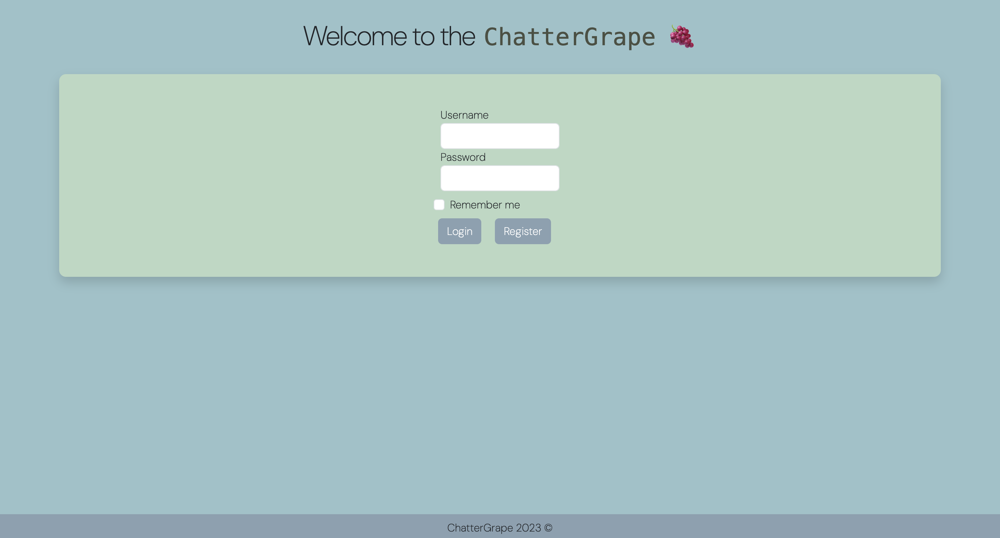
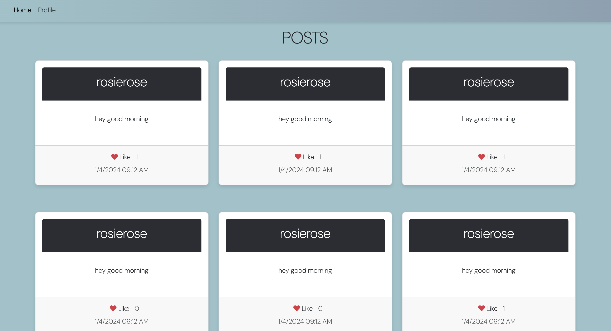

# ChatterGrape 🍇

_ChatterGrape allows users to register, login, logout, make post, delete post, like post, dislike post, and view their own profiles._

# Live Preview

[ChatterGrape Live Preview Site](https://jewelsonmyjeans.github.io/microbloglite-capstone-starter/)
- Note that this live preview will not work due to URL being secured (https instead of http)

# Preview

### Login 
 - Allows users to login using a real username and password created on the register page.



### Register Page
- Allows users to register for an account.
- Checks to see if users use the minimum amount of characters.
- Checks to see if password and confirmed password are exactly the same.


### Post Page 
- Allows users to see post.
- Allows you to like or dislike a post.
- Allows you to delete your post.



### Profile View Page
- Allows you to create a post.
- Allows you to logout.


# Tech

- HTML
- CSS
- Bootstrap
- Javascript
- API

# Collaborators

- Aviad Churaman
- Jeanette Gonzalez
- Tina Nguyen

# Interesting Code

### Aviad

*"I found this if statement very interesting to me because I didn't know how to use the .ok Response property. It basically returns a boolean if the response was accepted or successful."*
```
if (response.ok) {
        window.location.href = "../index.html";
    }
```

### Jeanette

*"I found the most interesting because it uses a ternary operator to conditionally render the delete button only if the user is logged in and if its their post so that the user cannot delete other users posts."*
```
${post.username === loginData.username ? 
```

### Tina

*"An interesting code for me was enforcing the max character lengths. Using JS to check the length and making sure it doesn't passed the MAXlength that I created. If criteria is within this length, then the Post will be created.. That was the interesting piece of code that I brainstormed, googled and learned."*

```
function isArticleLengthValid() {
    const title = blogTitleField.value;
    const article = articleField.value;
    const maxArticleLength = 200;
    const maxTitleLength = 50;
    return title.length <= maxTitleLength && article.length <= maxArticleLength;
}
```

# Acknowledgments

- [_MicroblogLite_ API docs](http://microbloglite.us-east-2.elasticbeanstalk.com)
