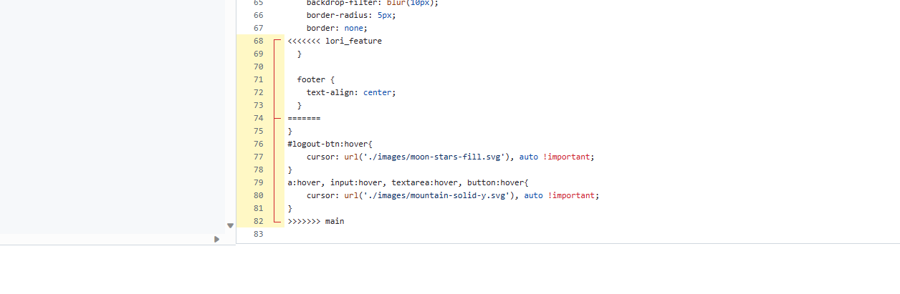
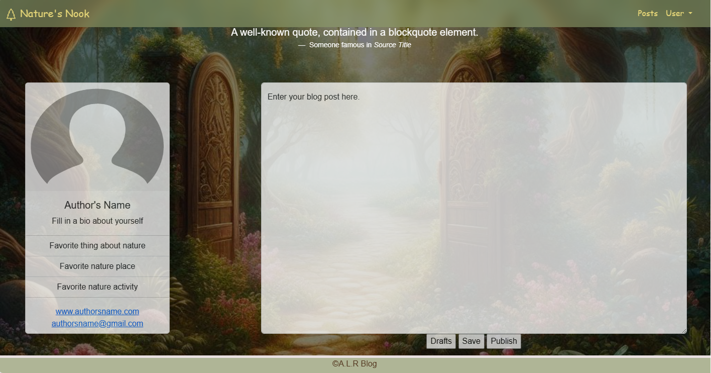
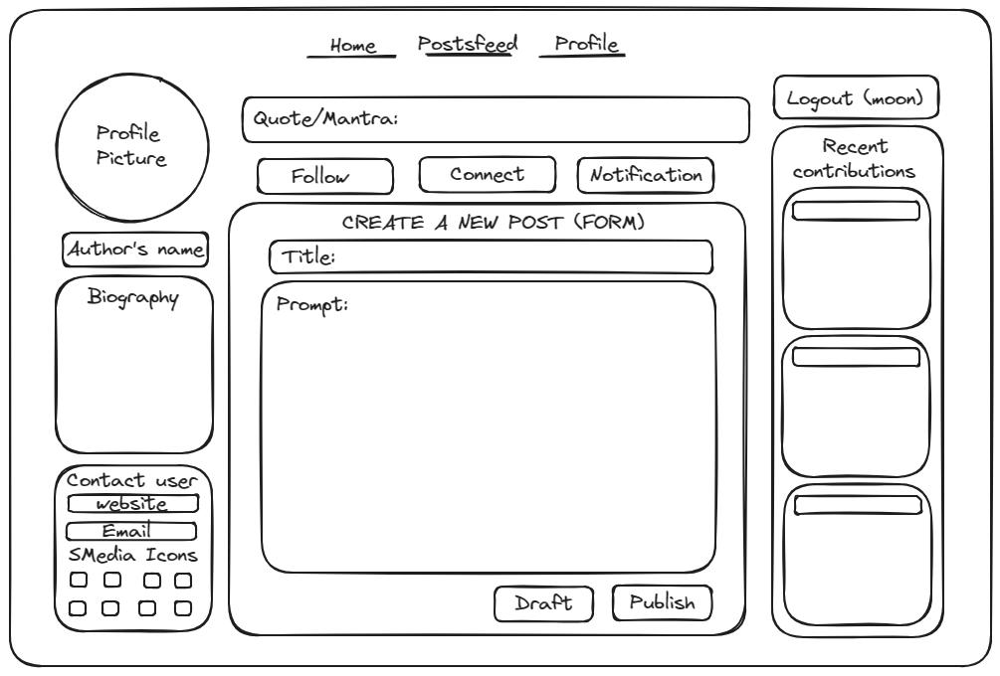

# Capstone 3: Microblog Network

### Description: 

Desc


## Landing/Login Page

The home page has a simple, responsive design with a navbar linking to the other pages

<p align="center" width="100%">
     
</p>


## Registration Page

Short description...

<p align="center" width="100%">
     
</p>

## Posts Page

Short description...

<p align="center" width="100%">
     
</p>

## User Profile Page
### Description
- On the profile page you'll find the Author's photo, name, bio, a few things about them, as well as any contact info they'd like to provide to their audience/readers. Along with the Author's personal information, the user will be able to create new blog posts as well as save and edit blog posts from thier drafts. 

### Interesting code snippet

```
function saveDraft(draftData) {
        //saving the draft to local storage
        localStorage.setItem("draftData", JSON.stringify(draftData));

        //informs user of Draft being saved
        alert("Draft has been saved!");
    }

    function getDrafts() {
        // pulling the draft from local storage
        let draftDataLocal = localStorage.getItem("draftData")
        console.log(draftDataLocal);
        blogPostInputEl.value = JSON.parse(draftDataLocal).text;
    }
```
- I found this code to be the most interesting because it allowed me to both save the blog post draft to the local storage as well as retrieve that data back into the textarea for my blog post. It gave me a sense of satisfaction to see my text retrieved from the local data and then be able to publish it.

### Photos
- Photo of a merge conflict that my team had while working together. Just needed to approve changes to the css page.

<p align="center" width="100%">
     
</p>

- Photo of what our profile page looks like currently

<p align="center" width="100%">
     
</p>

- Photo of the site map for what I was going for when I started the profile page. I thought it would be cool to show how the rough draft and final actually differ as you work towards a project. I would still like to add some of the features in the future though. 

<p align="center" width="100%">
     
</p>


## Responsive Design

All Pages are responsive through the use of Bootstrap 5

<p align="center" width="100%">
     
     
     
     
</p>

### Interesting Code

Talk about code...

**CSS**
```

```