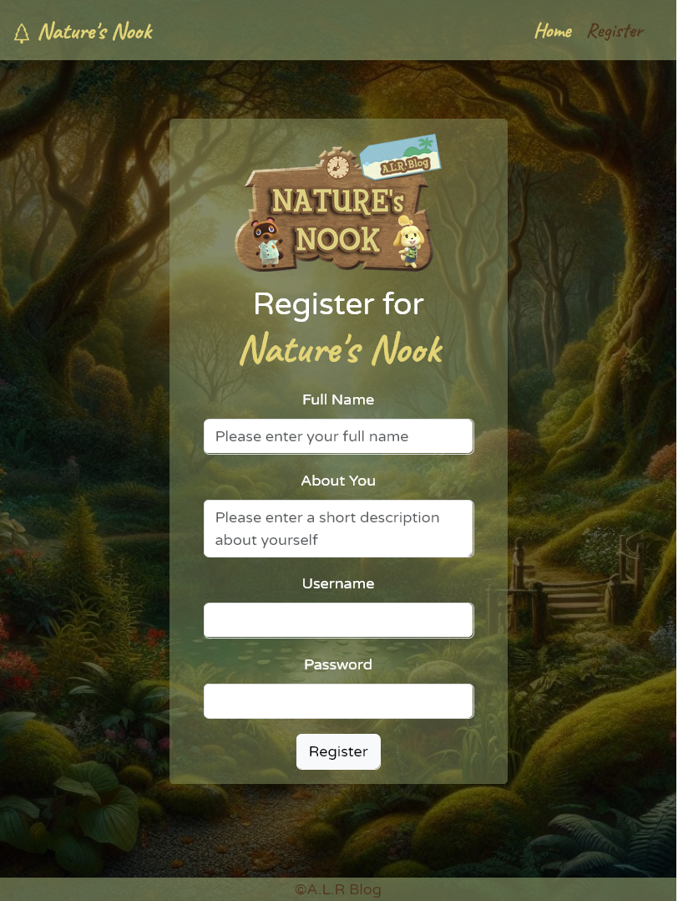

# Capstone 3: Microblog Network

### Description: 

"Nature's Nook Blog" is a web platform that provides users with the opportunity to engage with nature-related content through various features, including the ability to create an account, customize profiles, upload content, and interact with posts through likes and deletions.


## Authors

- Aysu [@kitsuana](https://github.com/kitsuana)
- Lori [@Wilsonl1](https://github.com/Wilsonl1)
- Rose [@rtorchon18](https://github.com/rtorchon18)

## Color Reference

| Color             | Hex                                                                |
| ----------------- | ------------------------------------------------------------------ |
| Background Color 1|  #E8DFE0|
| Background Color 2|  #8d9b6a |
| Background Color 3|  #8d9b6a9f |
| Nav Color 1 |  #E3D477|
| Nav Color 2|  #8F5B34 |
| Nav Color 3|  #53361e |


## Landing/Login Page

The home page has a simple, responsive design. It allows users to login with a username and password if it is in the API and has a navbar linking to the Register page.

<p align="center" width="100%">
     
</p>


## Registration Page

The registration page's main feature is the registration form which utilized Bootstrap to help with responsiveness. It links to the home page through the navbar and redirects the user back to the home page after they register. 

<p align="center" width="100%">
     
</p>

## Posts Page

User has the ability to view posts in real time as well as interaction by liking and unliking posts.

<p align="center" width="100%">
     
</p>

## Interesting Code Snippet 
```
posts.forEach((post) => {
     const postElement = document.createElement("div");
     postElement.classList.add("card");

    const createdAt = new Date(post.createdAt);
    const formattedDate = `${createdAt.getMonth() + 1}-${createdAt.getDate()}-${createdAt.getFullYear()}`;
    const formattedTime = `${createdAt.getHours()}:${createdAt.getMinutes()}:${createdAt.getSeconds()}`;

     postElement.innerHTML = `
             <div class="card-body">
                       <h4 class="card-title">${post.username}</h4>
                       <p class="card-text">${post.text}</p>
                       <p class="card-text">${formattedDate} ${formattedTime}<small class="text-body-secondary"></small></p>
                       
                       <div class="btns">
                           <button id="likeButton${post._id}" class="btn-like btn btn-light">
                               <svg xmlns="http://www.w3.org/2000/svg" height="16" width="16" viewBox="0 0 512 512">
                                   <path opacity="1" fill="#8d9b6a" d="M512 32c0 113.6-84.6 207.5-194.2 222c-7.1-53.4-30.6-101.6-65.3-139.3C290.8 46.3 364 0 448 0h32c17.7 0 32 14.3 32 32zM0 96C0 78.3 14.3 64 32 64H64c123.7 0 224 100.3 224 224v32V480c0 17.7-14.3 32-32 32s-32-14.3-32-32V320C100.3 320 0 219.7 0 96z"/>
                               </svg>
                               Like
                           </button>
                           
                           <button id="unlikeButton${post._id}" class="btn-unlike btn btn-light">
                               <svg xmlns="http://www.w3.org/2000/svg" height="16" width="16" viewBox="0 0 512 512">
                                   <path opacity="1" fill="#8f5b34" d="M288 120c0-30.9 25.1-56 56-56s56 25.1 56 56v13c-29.3 10-48 34.5-48 70.1c0 27.9 25.3 74.8 66 111.6c3.8 3.5 8.9 5.3 14 5.3s10.2-1.8 14-5.3c40.7-36.8 66-83.7 66-111.6c0-35.6-18.7-60.2-48-70.1V120C464 53.7 410.3 0 344 0S224 53.7 224 120v21.8C207.3 133 188.2 128 168 128c-66.3 0-120 53.7-120 120v13c-29.3 10-48 34.5-48 70.1C0 359 25.3 405.9 66 442.7c3.8 3.5 8.9 5.3 14 5.3s10.2-1.8 14-5.3c40.7-36.8 66-83.7 66-111.6c0-35.6-18.7-60.2-48-70.1V248c0-30.9 25.1-56 56-56s56 25.1 56 56v32V480c0 17.7 14.3 32 32 32s32-14.3 32-32V280 248 120z"/>
                               </svg>
                               Unlike
                           </button>
                       </div>
                   </div>
         `;
     postsContainer.appendChild(postElement);
   });
```

- I found this code to be the most interesting beacuse this code dynamically creates HTML elements (representing posts) based on the data in the posts array. It includes the post's username, text, formatted date and time, and buttons for liking and unliking. The generated elements are appended to an existing container in the HTML document.

## User Profile Page
### Description
- On the profile page you'll find the Author's photo, name, bio, a few things about them, as well as any contact info they'd like to provide to their audience/readers. Along with the Author's personal information, the user will be able to create new blog posts as well as save and edit blog posts from thier drafts. 

### Interesting code snippet

```
function saveDraft(draftData) {
        //saving the draft to local storage
        localStorage.setItem("draftData", JSON.stringify(draftData));

        //informs user of Draft being saved
        alert("Draft has been saved!");
    }

    function getDrafts() {
        // pulling the draft from local storage
        let draftDataLocal = localStorage.getItem("draftData")
        console.log(draftDataLocal);
        blogPostInputEl.value = JSON.parse(draftDataLocal).text;
    }
```
- I found this code to be the most interesting because it allowed me to both save the blog post draft to the local storage as well as retrieve that data back into the textarea for my blog post. It gave me a sense of satisfaction to see my text retrieved from the local data and then be able to publish it.

### Photos
- Photo of a merge conflict that my team had while working together. Just needed to approve changes to the css page.

<p align="center" width="100%">
     
</p>

- Photo of what our profile page looks like currently

<p align="center" width="100%">
     
</p>

- Photo of the site map for what I was going for when I started the profile page. I thought it would be cool to show how the rough draft and final actually differ as you work towards a project. I would still like to add some of the features in the future though. 

<p align="center" width="100%">
     
</p>


## Responsive Design

All Pages are responsive through the use of Bootstrap 5

<p align="center" width="100%">
     
     
</p>

### Interesting Code

An interesting bit of code is the custom SVG cursors CSS for the website. I had to do some research after the solid color mouse wasn't visible on all of the backgrounds. I created three different cursors and learned how to edit SVG color using fill, stroke, and stroke-width. 

**CSS**
```
body{
    cursor: url('./images/person-hiking-solid-db-lg.svg'), default !important;
}
#logout-btn:hover{
    cursor: url('./images/moon-stars-fill.svg'), auto !important;
}
a:hover, input:hover, textarea:hover, button:hover{
    cursor: url('./images/mountain-solid-y.svg'), auto !important;
}

<svg xmlns="http://www.w3.org/2000/svg" height="20" width="15" viewBox="0 0 384 512"><!--!Font Awesome Free 6.5.1 by @fontawesome - https://fontawesome.com License - https://fontawesome.com/license/free Copyright 2024 Fonticons, Inc.--><path opacity="1" fill="#1e140b" stroke="#e8dfe0" stroke-width="14" d="M192 48a48 48 0 1 1 96 0 48 48 0 1 1 -96 0zm51.3 182.7L224.2 307l49.7 49.7c9 9 14.1 21.2 14.1 33.9V480c0 17.7-14.3 32-32 32s-32-14.3-32-32V397.3l-73.9-73.9c-15.8-15.8-22.2-38.6-16.9-60.3l20.4-84c8.3-34.1 42.7-54.9 76.7-46.4c19 4.8 35.6 16.4 46.4 32.7L305.1 208H336V184c0-13.3 10.7-24 24-24s24 10.7 24 24v55.8c0 .1 0 .2 0 .2s0 .2 0 .2V488c0 13.3-10.7 24-24 24s-24-10.7-24-24V272H296.6c-16 0-31-8-39.9-21.4l-13.3-20zM81.1 471.9L117.3 334c3 4.2 6.4 8.2 10.1 11.9l41.9 41.9L142.9 488.1c-4.5 17.1-22 27.3-39.1 22.8s-27.3-22-22.8-39.1zm55.5-346L101.4 266.5c-3 12.1-14.9 19.9-27.2 17.9l-47.9-8c-14-2.3-22.9-16.3-19.2-30L31.9 155c9.5-34.8 41.1-59 77.2-59h4.2c15.6 0 27.1 14.7 23.3 29.8z"/></svg>
```