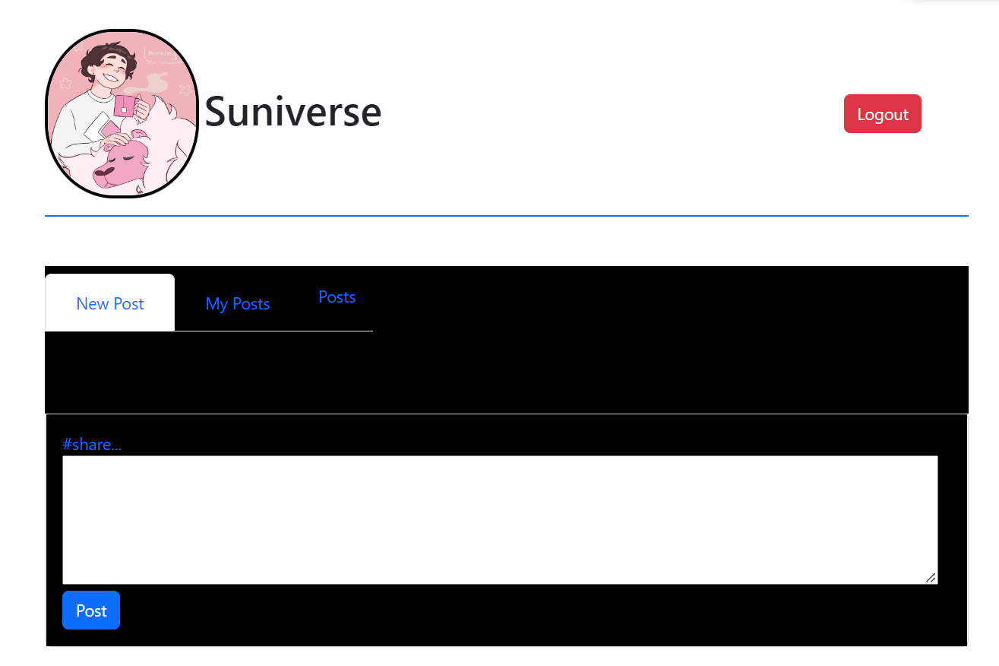

# The Experience with the Microblog Project and the MicroblogLite API!

<!-- Don't forget to read the [*MicroblogLite* API docs](https://microbloglite.herokuapp.com/docs/) and experiment with the API in *Postman!*

Practice and experimentation provide experience, and experience provides confidence. -->

## Group Progress
- As a group we decided it would better to use the project board to help everyone understand where we should individually start

- on Wednesday; We as a group(main votes from Ari and Rayna) wanted to go for a Universe Theme. We wanted to focus on blue, black, and white as the main colors.

## From Rayna Bell
-On Monday 12/8; I spent majority of the day setting up the layout of the page as well as setting up the form for the users to create a new page

- Tuesday 12/6; I focused on the Javascript and being able to call the API to make a new post

- On Wednesday 12/7; I got tired of looking at a basic page and decided to add a little style to add some umph.

- I hard coded the profile picture in the HTML just to give the page a profile feel. I was also able to get the logout button to properly work.  

-During this day I also worked on the javascript to display only the post from the logged in user. 

- On Thursday 12/8; I decided to get serious with the styling and try to go for the universe theme. My styling had many stages but the beginning of the final look started from the image below.

-The rest of Thursday I spent working on optional features such as including a functional edit button with being able to save and show the changes made.

## From Ari Black

## From Ja'ir Jabriel

## From Tarik Davis